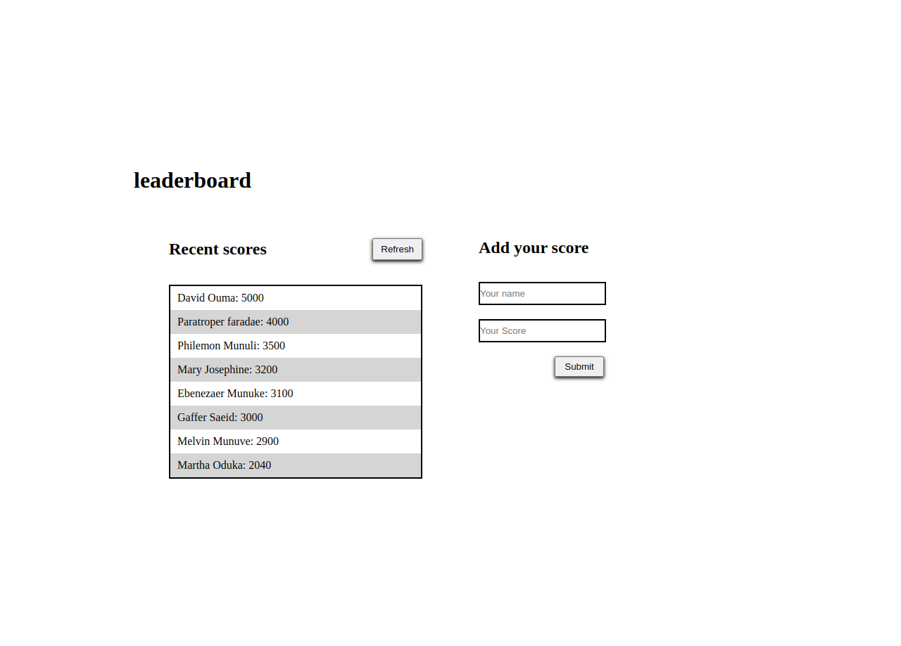

# LeaderBoard



> The leaderboard website displays scores submitted by different players. it also allows you to submit your score. All data is preserved thanks to the external Leaderboard API service. Checkout the live site [here](https://daudi13.github.io/LeaderBoard/dist/). The project is to be executed in three phases namely

### stages

- Project 1: basic page structure
- Project 2: send and receive data from API
- Project 3: Final touches

#### Cloning the project
```
git clone  https://github.com/daudi13/LeaderBoard.git/<Your-Build-Directory>
```

## running the project with webpack locally
```
npm install
```

```
npm run build
```

```
npm run start
```

## Getting packages and debuging with Stylelint
```
npm install --save-dev stylelint@13.x stylelint-scss@3.x stylelint-config-standard@21.x stylelint-csstree-validator@1.x
```
##### For validation detection using Stylelint Run
```
npx stylelint "**/*.{css,scss}"
```
##### from parent source directory

## Getting packages and debuging with ESlint
```
npm install npm install --save-dev eslint@7.x eslint-config-airbnb-base@14.x eslint-plugin-import@2.x babel-eslint@10.x
```
##### For validation detection using Stylelint Run
```
npx eslint .
```
##### from parent source directory

## Getting packages and debuging with Webhint
```
npm init -y
npm install --save-dev hint@6.x
```
##### For validation detection using Webhint Run
```
npx hint .
```

 ## 🤝 Contributing

Feel free to check the [issues page](../../issues/).

## Show your support

Give a ⭐️ if you like this project!

## Authors

- David Ouma [github](https://github.com/daudi13)
## 📝 License

This project is [MIT](./LICENCE) licensed.